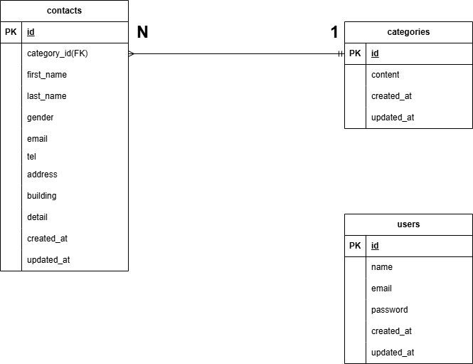

# お問い合わせフォーム

## 環境構築
### Docker ビルド
1. git clone git@github.com:Kumicho-naka/contact-app.git
2. docker compose up -d --build

### Laravel 環境構築
1. docker compose exec php bash
2. composer install
3. .env.exampleファイルから.envを作成し、環境変数を変更
4. php artisan key:generate
5. php artisan migrate
6. php artisan db:seed

## 使用技術 (実行環境)
- PHP 8.1.33
- Laravel 8.83.29
- Nginx 1.21.1
- MySQL 8.0.26
- Docker / docker-compose
- 認証: Laravel Fortify 1.19.1

## テスト
- PHPUnit
- テストDB: SQLite (pdo_sqlite / sqlite3 有効)

## ER図

## URL
- 開発環境：http://localhost/
- phpMyAdmin：http://localhost:8080/